[![Contributors][contributors-shield]][contributors-url]
[![Forks][forks-shield]][forks-url]
[![Stargazers][stars-shield]][stars-url]
[![Issues][issues-shield]][issues-url]

 

        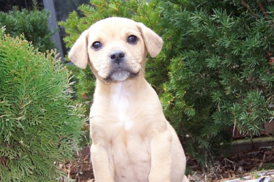
        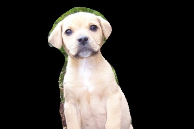
    <h2 align="center" style="margin: 20px">Image Segmentation Project</h3>

 

<!-- TABLE OF CONTENTS -->

    
Summary

    <ol>
        <li><a href="#institution">Institution</a></li>
        <li><a href="#built-with">Built with</a></li>
        <li><a href="#collaborators">Collaborators</a></li>
        <li><a href="#description">Description</a></li>
        <li><a href="#metodology">Metodology</a></li>
        <li>
            <a href="#eesults">Results</a>
            <ul>
                <li><a href="#explanation">Explanation</a></li>
            </ul>
        </li>
        <li><a href="#acknowledgments">Acknowledgments</a></li>
    </ol>

## Institution

- Universidade São Francisco - Campus Bragança

## Collaborators

- [Lucas Muner Garcia][lucas-linkedin-url]
- [Matheus Campos Negretti][matheus-linkedin-url]
- [Renan Alexandre Maciel Couto][renan-linkedin-url]
- [Samuel Teodoro Moreira Dias][samuel-linkedin-url]

## Built with

Below are listed the technologies used to implement this image segmentation project:

[![processing][processing-shield]][processing-url]  

## Description

In the realm of computer vision, image segmentation stands as a pivotal technique in image processing. This method involves partitioning a selected image into smaller segments, typically exhibiting strong correlations with real objects or areas of interest within the image. Through this process, the image's representation can be simplified or modified to render it more meaningful and readily analyzable.

This project selected an image database depicting everyday scenarios. However, we chose to narrow down our focus by selecting images of dogs within this database. When properly segmented according to specified criteria, these images can serve as a basis for various application scenarios.

## Metodology

Image processing filters are fundamental techniques for improving the visual quality of images or preparing them for more advanced analyses, such as segmentation and identification of specific features. To perform segmentation, we use the filtering techniques learned in the classroom. Below are listed the filters used, along with a brief description of each:

- Sobel Filter: Its function is to detect the edges of an image. To perform detection, the difference between the intensity of pixels in two different directions (horizontal and vertical) is calculated.

- Average Filter (6x6): Its function is to reduce the noise of an image through smoothing techniques, making it sharper. This mentioned filter uses a 6x6 pixel window, where the average of the pixel values within this area is calculated, and the value of the central pixel is replaced by the obtained average.

- Thresholding: It is a method based on pixel intensity, commonly used to highlight areas of interest in an image. The filter works by defining a threshold value. From this value, pixels with intensity above it are converted to one value (usually white), and those below are converted to another (usually black).

- Bounding Box: Its function is to locate and define the region around an object, highlighting items of interest in images. It involves drawing a rectangle that fully encapsulates the desired object.

## Results

Below are the project results, comprising segmented images, charts and percentages for true positives, false positives, and false negatives.

### Explanation

Positive values are understood as those that match in the generated bitmap and the original. A false positive occurs when the generated bitmap indicates that a pixel belongs to a segmented image, but when compared with the original bitmap, the pixel does not belong. A false negative, on the other hand, occurs when the generated bitmap indicates that a pixel does not belong to the segmented image, but when compared with the original bitmap, the pixel does belong.

The image on the far left depicts the original image from the dataset. Adjacent to it is the original ground truth image from the dataset. Moving towards the right, we have the generated ground truth image, followed by the segmented colored image on the far right. This segmented image was produced by extracting the original picture using the generated ground truth.

The values displayed in the graphic are the numbers of pixels in each category.

#### Image 0048

    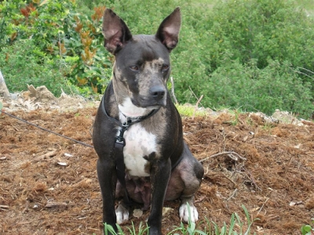
    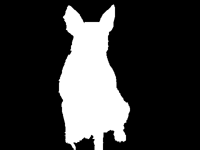
    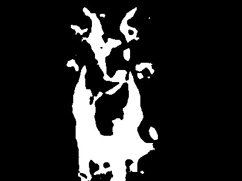
    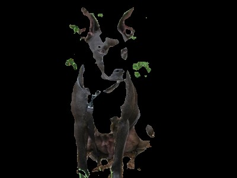
     
     
    

- Positives: 89.49%
- False positives: 8.97%
- Falso negatives: 1.54%

#### Image 0049

    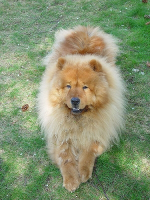
    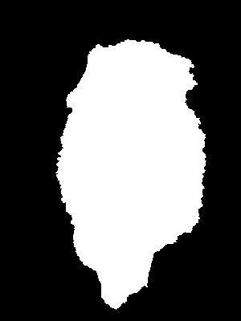
    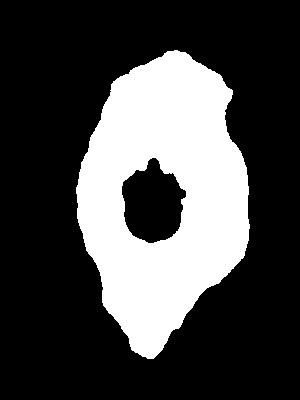
    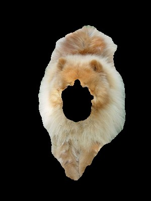
     
     
    

- Positives: 90.99%
- False positives: 9%
- Falso negatives: 0.01%

#### Image 0051

    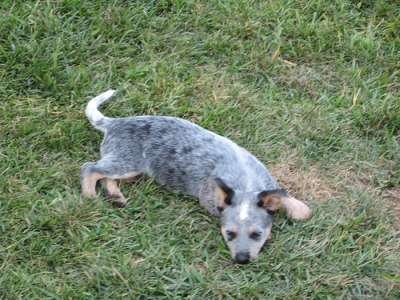
    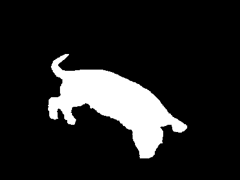
    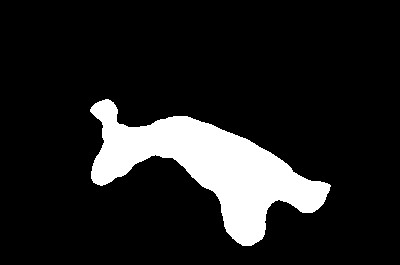
    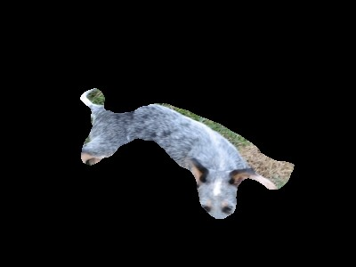
     
     
    

- Positives: 93.71%
- False positives: 4.06%
- Falso negatives: 2.23%

#### Image 0055

    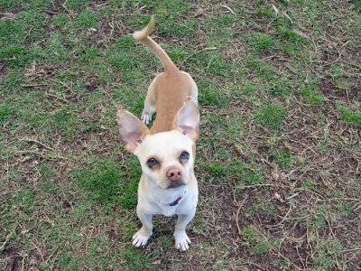
    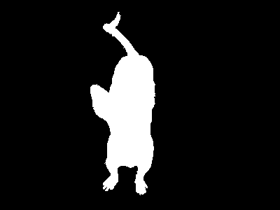
    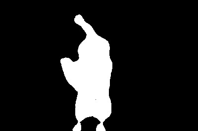
    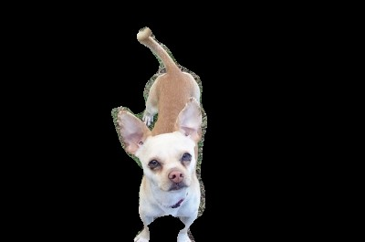
     
     
    

- Positives: 98.01%
- False positives: 0.36%
- Falso negatives: 1.63%

#### Image 0057

    
    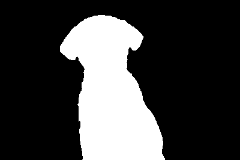
    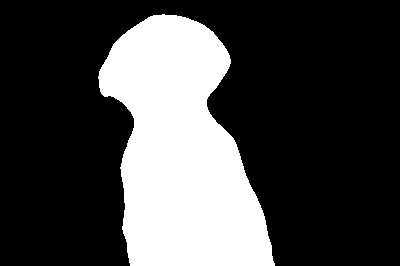
    
     
     
    

- Positives: 96.76%
- False positives: 2.8%
- Falso negatives: 0.44%

#### Image 0059

    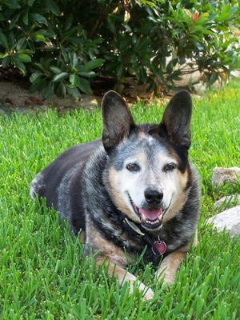
    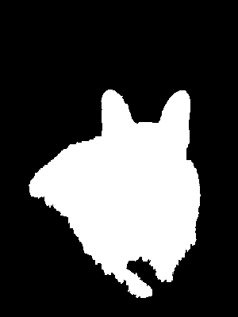
    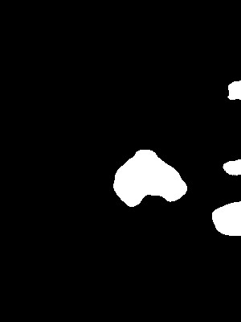
    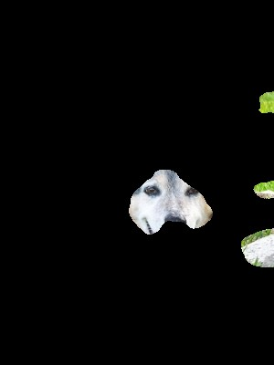
     
     
    

- Positives: 74.41%
- False positives: 1.6%
- Falso negatives: 23.99%

#### Image 0958

    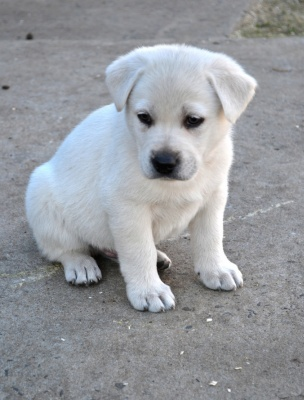
    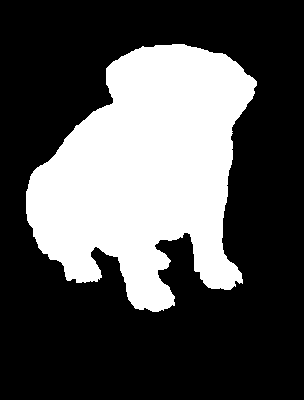
    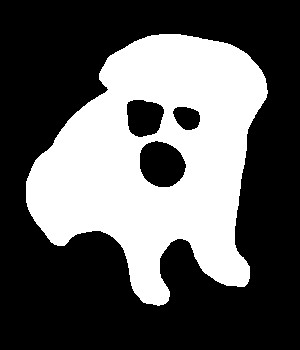
    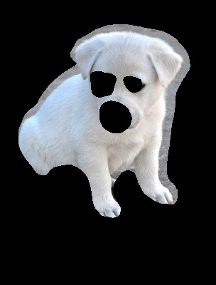
     
     
    

- Positives: 89.4%
- False positives: 4.88%
- Falso negatives: 5.72%

## Acknowledgments

- Image dataset utilized: [Extended Complex Scene Saliency Dataset (ECSSD)][ecssd-url]

[contributors-shield]: https://img.shields.io/github/contributors/samuel-tmd/imageSegmentation.svg?style=for-the-badge
[contributors-url]: https://github.com/samuel-tmd/imageSegmentation/graphs/contributors
[forks-shield]: https://img.shields.io/github/forks/samuel-tmd/imageSegmentation.svg?style=for-the-badge
[forks-url]: https://github.com/samuel-tmd/imageSegmentationnetwork/members
[stars-shield]: https://img.shields.io/github/stars/samuel-tmd/imageSegmentation.svg?style=for-the-badge
[stars-url]: https://github.com/samuel-tmd/imageSegmentation/stargazers
[issues-shield]: https://img.shields.io/github/issues/samuel-tmd/imageSegmentation.svg?style=for-the-badge
[issues-url]: https://github.com/samuel-tmd/imageSegmentation/issues
[processing-shield]: https://img.shields.io/badge/Processing-0000FF?style=for-the-badge&logo=processingfoundation&logoColor=white
[processing-url]: https://processing.org/
[ecssd-url]: https://www.cse.cuhk.edu.hk/leojia/projects/hsaliency/dataset.html
[lucas-linkedin-url]: https://www.linkedin.com/in/lucas-muner-21388621a/
[matheus-linkedin-url]: https://www.linkedin.com/in/matheus-negretti-b177a8307
[renan-linkedin-url]: https://www.linkedin.com/in/renan-couto-62404892/
[samuel-linkedin-url]: https://www.linkedin.com/in/samuel-dias4a5a/