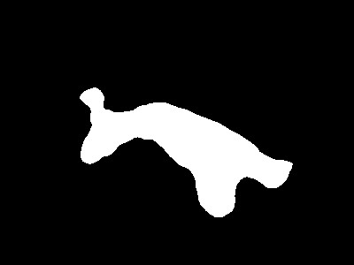

[![Contributors][contributors-shield]][contributors-url]
[![Forks][forks-shield]][forks-url]
[![Stargazers][stars-shield]][stars-url]
[![Issues][issues-shield]][issues-url]

 

        
        
    <h2 align="center" style="margin: 20px">Image Segmentation Project</h3>

 

<!-- TABLE OF CONTENTS -->

    
Summary

    <ol>
        <li><a href="#institution">Institution</a></li>
        <li><a href="#built-with">Built with</a></li>
        <li><a href="#collaborators">Collaborators</a></li>
        <li><a href="#description">Description</a></li>
        <li><a href="#eesults">Results</a></li>
        <li><a href="#acknowledgments">Acknowledgments</a></li>
    </ol>

## Institution

- Universidade São Francisco - Campus Bragança

## Collaborators

- [Lucas Muner Garcia][lucas-linkedin-url]
- [Matheus Campos Negretti][matheus-linkedin-url]
- [Renan Alexandre Maciel Couto][renan-linkedin-url]
- [Samuel Teodoro Moreira Dias][samuel-linkedin-url]

## Built with

Below are listed the technologies used to implement this image segmentation project:

[![processing][processing-shield]][processing-url]  

## Description

## Results

### Explanation

#### Image 0048

    
    
    
    
     
     
    

- Positive: 89.49%
- False positive: 8.97%
- Falso negative: 1.54%

#### Image 0049

    
    
    
    
     
     
    

- Positive: 90.99%
- False positive: 9%
- Falso negative: 0.01%

#### Image 0051

    
    
    
    
     
     
    

- Positive: 93.71%
- False positive: 4.06%
- Falso negative: 2.23%

#### Image 0055

    
    
    
    
     
     
    

- Positive: 98.01%
- False positive: 0.36%
- Falso negative: 1.63%

#### Image 0057

    
    
    
    
     
     
    

- Positive: 96.76%
- False positive: 2.8%
- Falso negative: 0.44%

#### Image 0059

    
    
    
    
     
     
    

- Positive: 74.41%
- False positive: 1.6%
- Falso negative: 23.99%

#### Image 0958

    
    
    
    
     
     
    

- Positive: 89.4%
- False positive: 4.88%
- Falso negative: 5.72%

## Acknowledgments

- Image dataset utilized: [ECSSD][ecssd-url]

[contributors-shield]: https://img.shields.io/github/contributors/samuel-tmd/imageSegmentation.svg?style=for-the-badge
[contributors-url]: https://github.com/samuel-tmd/imageSegmentation/graphs/contributors
[forks-shield]: https://img.shields.io/github/forks/samuel-tmd/imageSegmentation.svg?style=for-the-badge
[forks-url]: https://github.com/samuel-tmd/imageSegmentationnetwork/members
[stars-shield]: https://img.shields.io/github/stars/samuel-tmd/imageSegmentation.svg?style=for-the-badge
[stars-url]: https://github.com/samuel-tmd/imageSegmentation/stargazers
[issues-shield]: https://img.shields.io/github/issues/samuel-tmd/imageSegmentation.svg?style=for-the-badge
[issues-url]: https://github.com/samuel-tmd/imageSegmentation/issues
[processing-shield]: https://img.shields.io/badge/Processing-0000FF?style=for-the-badge&logo=processingfoundation&logoColor=white
[processing-url]: https://processing.org/
[ecssd-url]: https://www.cse.cuhk.edu.hk/leojia/projects/hsaliency/dataset.html
[lucas-linkedin-url]: https://www.linkedin.com/in/lucas-muner-21388621a/
[matheus-linkedin-url]: www.linkedin.com/in/matheus-negretti-b177a8307
[renan-linkedin-url]: https://www.linkedin.com/in/renan-couto-62404892/
[samuel-linkedin-url]: https://www.linkedin.com/in/samuel-dias4a5a/